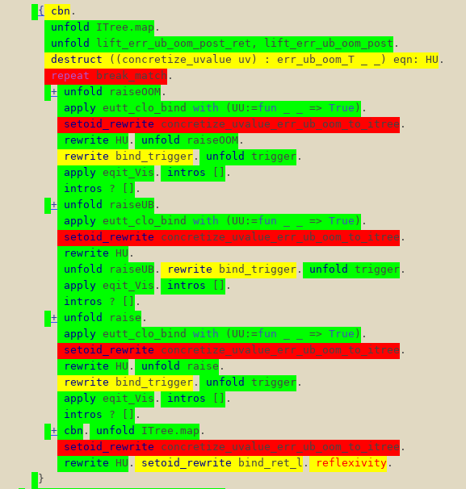

* Introduction

This package is used to overlay timing information from ~.v.timing~
files in the current buffer to make profiling Rocq easier. The main
commands provided by this package are:

- ~rocq-timing-overlays~: adds timing overlays.
- ~rocq-timing-overlays-clear~: removes the timing overlays.

* Screenshots

